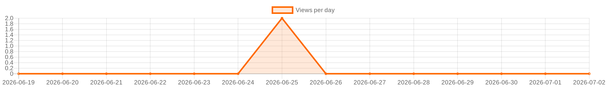

<!-- LANG_START -->
🇷🇺 [Русская версия](README.md)
<!-- LANG_END -->

<div align="center">


</div>


<!-- STATS_START -->
<!-- auto-updated by GitHub Actions · 2026-07-06 23:01 UTC -->

[](https://github.com/gooog1111/SupportChat)
[](https://github.com/gooog1111/SupportChat)
[](https://github.com/gooog1111/SupportChat)
[](https://github.com/gooog1111/SupportChat)
[](https://github.com/gooog1111/SupportChat/stargazers)
[](https://github.com/gooog1111/SupportChat/network/members)
[](https://github.com/gooog1111/SupportChat/releases/latest)
[](https://github.com/gooog1111/SupportChat/releases)

<!-- STATS_END -->


<!-- GRAPH_START -->
<p align="center">
  
</p>
<!-- GRAPH_END -->


<!-- ISSUES_START -->
<!-- auto-updated by GitHub Actions · 2026-07-06 23:01 UTC -->

## Issues

<p>
  <a href="https://github.com/gooog1111/SupportChat/issues">
    
  </a>
  <a href="https://github.com/gooog1111/SupportChat/issues/new/choose">
    
  </a>
</p>

<details open>
<summary><b>Open issues</b></summary>


<p align="center">
  <b>No open issues.</b><br>
  <sub>The service issue <code>views-counter</code> is hidden from the list.</sub>
</p>


</details>

<p>
  <a href="https://github.com/gooog1111/SupportChat/issues/new/choose">Create new issue</a> ·
  <a href="https://github.com/gooog1111/SupportChat/issues">All issues</a>
</p>

<!-- ISSUES_END -->


## Technical support chat

## ⚠️ Attention  
This file has been automatically edited.

---

A simple and (not very) secure chat for organizing technical support, divided into client and administrative interfaces. Runs on Apache, Nginx or IIS without using a database or Node.js.


---


---

## 🚀 Features
- **Client part**  
  - 📤 Send text and images (up to 5 MB)
  - 📅 Correspondence history
  - 🕒 Group messages by time (2 minute intervals)
  - 🔄 Automatic session recovery  
  - 👤 Unique session ID for each client
- **Administrative panel**
  - 🎯 Dynamic chat updates (every 10 sec)
  - 🚦 Status system:
    - `🟢 Открыт` 
    - `🟡 В работе (Имя админа)`
    - `🔴 Закрыт`
  - 🛠 Chat management (open/close/clear)  
  - 🔍 View client metadata (IP, PC name)  
  - 📊 Chat statuses (Open, In progress, Closed)  
  - 🔄 Automatic update of chat list
- **Safety**  
  - 🔒 XSS and CSRF protection  
  - 🔑 Session and authorization system  
  - 📁 Storing data in JSON files  
  - 🔄 Regular cleaning of inactive sessions
- **Adaptability**  
  - 📱 Optimized for mobile devices

## ⚙️ Server requirements
## # Required components
| Component | Minimum version | 
|----------------|--------------------|
| PHP | 7.4+ |
| Web server | Apache/Nginx/IIS | 

## # Required PHP modules
```bash
sudo apt install php7.4-fileinfo php7.4-json php7.4-session  # Для Linux
```
- **Web server**: Apache, Nginx or IIS  
- **Write permissions** for folders: `uploads/`, `chats/`, `clients/`, `logs/`  

---

## ⚙️ Installation

## # 🪟Windows  
## ## For IIS:  
1. Set [PHP для Windows](https://windows.php.net/download/) and add the PHP path to the `PATH` variable.  
2. In **IIS Manager**:  
   - Create a website with a project root folder.  
   - Set the `*.php` handler to `php-cgi.exe`.  
3. Set up permissions:  
   ```powershell  
   icacls "C:\путь_к_проекту" /grant IIS_IUSRS:(OI)(CI)F  
   ```
## ## For Apache (via XAMPP/WAMP):  
1. Copy the `chat` folder to `htdocs/`.  
2. Add a virtual host:  
   ```apache  
   <VirtualHost *:80>  
       DocumentRoot "C:/xampp/htdocs/chat"  
       ServerName chat.local  
       <Directory "C:/xampp/htdocs/chat">  
           AllowOverride All  
           Require all granted  
       </Directory>  
   </VirtualHost>  
   ```
3. Restart Apache.

---

## # 🐧 Linux  
## ## Apache:  
1. Install packages:  
   ```bash  
   sudo apt install apache2 php libapache2-mod-php php-fileinfo  
   ```
2. Place the project in `/var/www/html/chat`.  
3. Set up a virtual host:  
   ```apache  
   <VirtualHost *:80>  
       DocumentRoot /var/www/html/chat  
       ServerName chat.local  
       <Directory "/var/www/html/chat">  
           Options FollowSymLinks  
           AllowOverride All  
           Require all granted  
       </Directory>  
   </VirtualHost>
   
4. Настройте права:  
   ```bash  
   sudo chown -R www-data:www-data /var/www/html/chat/  
   ```
## ## Nginx:  
1. Установите пакеты:  
   ```bash  
   sudo apt install nginx php-fpm php-fileinfo
   ```
2. Добавьте конфигурацию:  
   ```nginx  
   server {  
       listen 80;  
       root /var/www/html/chat;  
       index index.php;  
       
       location/{  
           try_files $uri $uri/ /index.php?$args;  
       }location ~ \.php$ {  
           include snippets/fastcgi-php.conf;  
           fastcgi_pass unix:/run/php/php7.4-fpm.sock;  
       }  
   }  
   ```
---

## 🔍 Проверка работоспособности  
1. Создайте файл `info.php` в корне проекта:  
   
   ```php
   <?php phpinfo(); ?>
   ```
   
2. Откройте его в браузере. Убедитесь, что активны модули:  
   - fileinfo  
   - json  
   - session  

---

## 🔑 Настройка администраторов

Отредактируйте файл `includes/admins.php`:

```php
<?php $ADMINS = array (
  'admin' => 
  array (
    'password' => '$2y$10$DCjIXIdp9qF.HwZAQhkH8OUMtGuKcAyYjFDxSWPyn4OhkecGFCo4S',
    'name' => 'admin1',
  ),
  'admin1' => 
  array (
    'password' => '$2y$10$DCjIXIdp9qF.HwZAQhkH8OUMtGuKcAyYjFDxSWPyn4OhkecGFCo4S',
    'name' => 'admin2',
  ),
); ?>
```
```
Default login/password
admin/password
```
---
## 🛡️ Рекомендации по безопасности
## # Критически важные меры
1. **HTTPS** (настройка для Apache)
```apache
<VirtualHost *:443>
    SSLEngine on
    SSLCertificateFile /etc/ssl/certs/chat.crt
    SSLCertificateKeyFile /etc/ssl/private/chat.key
</VirtualHost>
```
3. **Очистка неактивных сессий** (Cron):
```bash
0 3 * * * find /path/to/clients/ -type f -mtime +1 -delete
```
5. **Резервное копирование**:
```bash
tar -czvf chat_backup_$(date +\%F).tar.gz chats/ clients/ uploads/
```
---
## 🖥 Использование
- **Клиентская часть**: http://ваш-сервер/chat/client/
- **Административная панель**: http://ваш-сервер/chat/admin/

## 📂 Структура проекта
```
chat/
├── admin/ # Administrator panel
│ ├── clear_chat.php # Clearing chat
│ ├── close_chat.php # Closing the chat
│ ├── dashboard.php # Main control panel
│ ├── get_chat_list.php# Getting a list of chats
│ ├── get_messages.php # Receive chat messages
│ ├── index.php # Redirect to login page
│ ├── login.php # Login page for administrator
│ ├── logout.php # Logout
│ ├── send_message.php # Sending messages from the administrator
│ ├── update_chat_status.php # Update chat status
│ ├── update_hostnames.php # Update client PC names
│ └── update_profile.php # Update the administrator profile
├── admin_online/ # Files for tracking the online status of administrators
    ├── index.php # Protection against direct access
├── assets/ # Project resources (styles, scripts, images)
│ ├── css/ # Styles
│ │ ├── admin.css # Styles for the admin panel
│ │ ├── all.min.css # Minified styles (for example, FontAwesome)
│ │ ├── index.php # Protection against direct access
│ │ └── styles.css # Basic styles for the client side
│ ├── images/ # Images
│ │ └── index.php # Protection against direct access
│ ├── js/ # JavaScript scripts
│ │ ├── admin.js # Scripts for the administrative panel
│ │ ├── index.php # Protection against direct access
│ │ └── script.js # Scripts for the client side
│ ├── webfonts/ # Fonts
│ │ └── index.php # Protection against direct access
│ └── index.php # Protection against direct access
├── chats/ # Message history (JSON files)
│ └── index.php # Protection against direct access
├── client/ # Client part
│ ├── get_messages.php # Receiving messages for the client│ ├── get_online_admins.php # Getting the number of online administrators
│ ├── index.php # Main client interface
│ ├── restore_session.php # Restoring a client session
│ └── send_message.php # Sending messages from the client
├── clients/ # Client data (JSON files)
│ └── index.php # Protection against direct access
├── includes/ # System scripts and configurations
│ ├── admins.php # Administrator data (logins, passwords, names)
│ ├── config.php # Basic project settings
│ ├── functions.php # Auxiliary functions (sanitization, CSRF tokens)
│ ├── index.php # Protection against direct access
│ ├── session.php # Session management
│ ├── storage.php # Functions for working with data (saving, updating)
│ └── upload_functions.php # Functions for uploading files
├── logs/ # Error logs
│ ├── error.log # Log file
│ └── index.php # Protection against direct access
├── uploads/ # Uploaded files (images)
│ └── index.php # Protection against direct access
└── index.php # Main file for redirecting to the client side
```

---

> ⚠️ **Important!** Before using in production, conduct a security audit and configure HTTPS.
